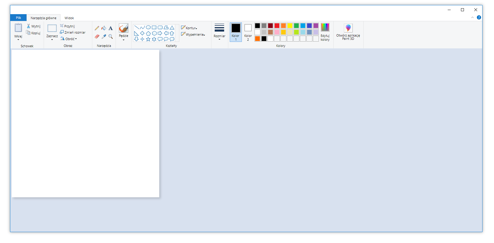

# Paint

Windows 10 Paint clone made with React and Redux



## Installing dependencies

```
npm i
```

## Starting the application in watch mode

```
# starts dev-server
npm start

# starts dev-server, opens the app in deafult browser
npm run start:open 
```

## Building the application

```
npm run build
```

## Running unit tests

```
# Watch mode
npm test

# Runs all unit tests once
npm run test:once
```

## Linting code

```
npm run lint
```
